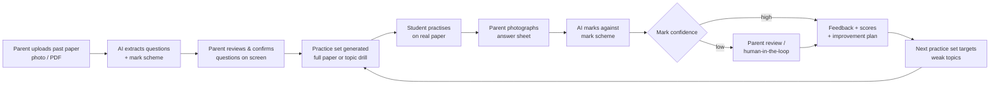
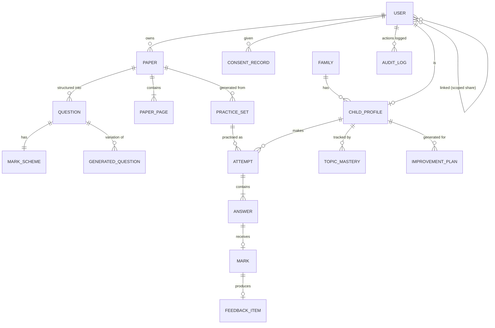
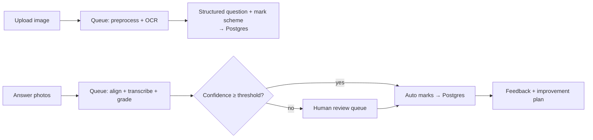

# Product Document — PaperLoop (working title)

**Working title:** PaperLoop · *"Upload. Practise. Mark. Improve."*
(alternatives considered: PaperPrep, MarkMate, ExamLoop, PractiPaper)

| | |
|---|---|
| Status | Draft v0.1 — for product brainstorming and review |
| Author | Architect agent (agentic-workflow harness) |
| Date | 2026-10-07 |
| Type | Greenfield product concept — no code, no repository, no task ID |

---

## Executive Summary

**PaperLoop** is a mobile app that closes the loop between *practising past exam papers* and *actually improving*. A parent (or a self-directed student) photographs or uploads a past question paper; the app digitises it, extracts the questions and mark scheme, and generates a practice set. The student answers **on real paper** — preserving the handwriting and exam-condition practice that matters for real exams — and then photographs the answer sheet. The app marks the answers against the mark scheme, explains what went wrong, and generates a personalised "what to improve" plan that drives the next practice set. Parents get a low-effort dashboard of progress, topic gaps, and exam readiness without needing subject expertise or hours of manual marking.

**Why now:** past papers are freely available but the *marking and feedback* step is still manual, which is exactly where parents run out of time and subject knowledge. AI vision + LLM technology now makes scan-and-grade of handwritten work viable at consumer cost, while the same technology creates serious new trust and privacy obligations — especially because the users include children.

**MVP (Phase 0, ~12 weeks):** paper upload via photo/PDF → AI question extraction with human-confirm step → practise-on-paper flow → answer-sheet photo marking with confidence scores and parent override → basic per-question feedback + topic-tag progress report. One market/curriculum, parent + teen accounts, full consent, export, and deletion controls from day one.

**Biggest open decisions:** which market/curriculum first; the marking-accuracy bar and who reviews low-confidence grades; the copyright posture for uploaded papers; and the business model that absorbs AI processing costs.

---

## 1. Vision & Problem Statement

### 1.1 Vision

> Every parent should be able to give their child the exam practice and feedback of a private tutor — at a fraction of the cost and effort.

### 1.2 The problem

| # | Pain point | Who feels it |
|---|---|---|
| P1 | Marking past papers is manual, slow, and error-prone; parents don't have time | Parents |
| P2 | Parents often lack subject depth (e.g., secondary maths/science) to mark *or* explain why an answer lost marks | Parents |
| P3 | Students get a raw score but no structured feedback on **why** they lost marks or **what** to work on next | Students |
| P4 | Past papers are scattered (school sites, exam boards, forums); finding the right paper at the right level is friction | Parents & students |
| P5 | Feedback loops are long — a paper marked "sometime this week" loses most of its learning value | Students |
| P6 | Tutoring is expensive and inaccessible for many families; practice workbooks are static and unmarked | Parents |
| P7 | Schools increasingly push independent revision but don't give parents tools to support it | Parents |

The underlying gap: **plenty of practice material exists, but the *feedback* layer — marking, explanation, and targeted next steps — is missing for most families.**

### 1.3 Value proposition

- **For parents:** "Snap the paper in, snap the answers in. Get a mark, an explanation, and a plan for what to do next — no subject expertise or free evening required."
- **For students:** "Practise on real paper like the real exam. Get feedback in minutes, not days. See exactly what to improve, and get practice sets that target your weak spots."
- **For tutors (optional later):** "Multiply your time: AI does first-pass marking, you review and coach."

### 1.4 Target users

| Segment | Description | Priority |
|---|---|---|
| Parents of learners aged ~8–18 | Time-poor, subject-shallow, high motivation around exam seasons | Primary |
| Self-directed students (13+, with consent) | Teenagers preparing for national/external exams who want independence | Primary |
| Tutors / teachers | Manage cohorts, review AI marking, generate reports | Secondary (v1+) |

### 1.5 Differentiation vs. alternatives

| Alternative | What it does | PaperLoop's edge |
|---|---|---|
| Generic flashcard/quiz apps (Quizlet, Anki, Kahoot) | Drill-style self-made cards | Real past-paper format, handwriting preserved, marking + improvement loop |
| Photo-OCR "scan and digitise" apps | Convert paper to text | We don't just digitise — we structure, generate practice, mark, and recommend |
| LMS / classroom tools (Google Classroom) | Teacher-centric distribution | Parent/consumer-centric, built around exam practice, no school admin needed |
| Human tutoring / marking services | High-quality feedback at high cost | 10–50× cheaper, instant, always available |
| Static past-paper websites | PDFs with mark schemes | Structured questions, automated marking, personalised analytics |

**Defensible moats over time:** per-curriculum grading quality (fine-tuned evals), the practice-history dataset per student (improvement plans get better with data), and trust infrastructure for minors' data.

### 1.6 Guiding principles

1. **Paper-first:** keep handwriting and exam conditions; the phone is a capture and feedback device, not the answer sheet.
2. **Feedback loop over score:** a mark without explanation is useless; every mark links to a reason and a next step.
3. **Privacy by design for minors:** minimum data, verified parental consent, no ads, no public profiles, no selling data.
4. **Trusted AI:** every automated mark carries a confidence score; humans can always review, override, and correct.
5. **Progressive trust:** earn the right to automate more (essays, method marks) as calibrated accuracy is proven.

---

## 2. Personas & User Journeys

### 2.1 Personas

| Persona | Profile | Goals | Frustrations |
|---|---|---|---|
| **Priya — parent** | 41, mother of an 11-year-old transitioning to secondary school; works full-time; comfortable with phone apps, not confident in secondary maths | Help her son practise effectively; know *how* he is doing without marking herself; prepare for entrance/school exams | No time to mark; doesn't know what "good" looks like; worksheets get done but never reviewed |
| **Daniel — student** | 15, preparing for GCSE/IGCSE-style exams; motivated; wants ownership of his revision | Practise past papers; understand mistakes fast; track progress; feel exam-ready | Manual marking is boring; tutor feedback arrives late; doesn't know what to practise next |
| **Ms. Chen — tutor** *(optional, v1+)* | 38, private tutor with 12 students | Scale her feedback; spot class-wide weak topics; produce parent reports quickly | Marking the same papers repeatedly; report-writing eats evenings |

### 2.2 End-to-end journey — Parent-led loop (core MVP flow)

Step-by-step:

1. **Onboarding:** Priya installs the app, signs up with email + OTP, selects role *Parent*, creates a child profile (name, age band, curriculum). Because her son is 11, the app completes the parental-consent flow (consent notice, confirm as the parent, ID-verified options, records consent version + timestamp). Her son gets an optional child-side profile with restricted permissions.
2. **First paper:** Priya photographs a maths past paper (multi-page capture with auto-crop). The app OCRs it, detects questions, marks allocations, and topic tags. Priya reviews the extraction (fixes one misread equation) and confirms — the "paper" is now in her library.
3. **Practice:** She generates a practice set — full mock or "topic drill" on fractions. The set can be printed, or questions shown one-at-a-time while her son writes answers in a notebook.
4. **Answer upload:** Priya photographs the completed answer sheet. The app aligns each written answer to the right question.
5. **Marking:** Within about a minute she gets a marked attempt — per-question scores with reasons, total score, and confidence indicators. One question is flagged *low confidence*; she reviews it in 20 seconds and adjusts a mark. Her correction feeds back into grading quality.
6. **Improve:** The app shows a "what to improve" report: fractions — addition of mixed numbers weak; recommended next practice set generated automatically. A weekly digest email/push summarises the week.
7. **Revision:** Before the real exam, she opens the archive of past attempts and the exam-readiness score.

### 2.3 End-to-end journey — Student-led loop (13+)

1. Daniel signs up (email/OTP or Apple/Google sign-in), declares age; at 15 in his jurisdiction he can self-consent, but linking a parent is encouraged for transparency.
2. Daniel finds/imports a past paper (photo, PDF, or import from a rights-cleared library).
3. He practises on paper in timed mode with the app as a timer.
4. He photographs his own answers; marking arrives in minutes.
5. He reviews per-question feedback, watches his topic-mastery heatmap, and completes the auto-generated "next practice" set targeting his weakest topic.
6. Weekly: he reviews his streak, mastery deltas, and exam-readiness score; optionally shares a report with his parent or tutor.

### 2.4 End-to-end journey — Tutor (v1+)

1. Ms. Chen onboards as *Tutor*, receives parent-linked student shares (scoped: student history, no account access).
2. She assigns a practice set to a cohort.
3. The AI first-pass marks all attempts; she reviews only low-confidence items in a review queue.
4. She exports per-student and class-level reports (topic gaps, trends) for parents.

---

## 3. Feature Set

Feature IDs use `F-<area>-<n>` and priority tags: **P0** = MVP, **P1** = v1, **P2** = later.

### 3.1 Onboarding, Authentication & Accounts (F-AUTH)

| ID | Feature | Priority | Notes |
|---|---|---|---|
| F-AUTH-1 | Email + password registration | P0 | With email verification |
| F-AUTH-2 | OTP / passwordless login | P0 | Primary login for parents (phone-first markets) |
| F-AUTH-3 | Social sign-in (Apple, Google) | P0 | Apple is required if any other social login exists (App Store rule); Sign in with Apple provides anonymous-email relay |
| F-AUTH-4 | Passkeys | P1 | Strong, phishing-resistant option |
| F-AUTH-5 | Role selection: Parent / Student / Tutor | P0 (P2 for Tutor) | Role drives permissions |
| F-AUTH-6 | Age declaration + age gate | P0 | Determines consent flow (see §5.3) |
| F-AUTH-7 | **Parental consent flow for minors** | P0 | Verified consent record (method, version, timestamp); parent identity verification options; withdrawal path |
| F-AUTH-8 | Child profile management under parent account | P0 | Multiple children per family; per-child curriculum |
| F-AUTH-9 | Linked/connected accounts (parent ↔ student ↔ tutor) | P1 | Scoped sharing, revocable |
| F-AUTH-10 | Guest trial mode | P1 | Limited: 1 paper, 1 marking, then sign-up |
| F-AUTH-11 | Account recovery, device management, session audit | P0 | Minors: recovery mediated through parent |
| F-AUTH-12 | Account deletion & full data export | P0 | Self-service; see §5.2 |

### 3.2 Question Paper Upload & Ingestion (F-PAPER)

| ID | Feature | Priority | Notes |
|---|---|---|---|
| F-PAPER-1 | Multi-page photo capture with auto-crop / de-skew | P0 | Edge detection, page flattening, low-light correction |
| F-PAPER-2 | PDF / image import (Files, share sheet, AirDrop) | P0 | |
| F-PAPER-3 | OCR for printed text | P0 | Includes tables, numbered questions, multiple-choice grids |
| F-PAPER-4 | **Question & mark-scheme structuring** | P0 | Detect question boundaries, marks per question, topic tags |
| F-PAPER-5 | Human-confirm extraction editor | P0 | Trust gate: user reviews detected questions before use; fixes errors |
| F-PAPER-6 | Handwriting OCR on papers | P1 | Some school papers are handwritten/copied |
| F-PAPER-7 | Maths notation (LaTeX) & diagram extraction | P1 | Equations, graphs, geometry figures — hardest OCR class |
| F-PAPER-8 | Subject/topic auto-tagging against curriculum | P0 | Seed taxonomy per curriculum |
| F-PAPER-9 | Duplicate paper detection (checksum/fingerprint) | P1 | Protects library hygiene & copyright |
| F-PAPER-10 | Rights-cleared community paper library | P2 | Public bank of legally shareable papers |
| F-PAPER-11 | Manual paper creation (build your own questions) | P1 | Power users / tutors |

### 3.3 Sample Question Generation (F-GEN)

| ID | Feature | Priority | Notes |
|---|---|---|---|
| F-GEN-1 | Practice set from extracted paper: full mock (timed) | P0 | Mirrors original paper structure |
| F-GEN-2 | Practice set by topic drill (subset of questions) | P0 | |
| F-GEN-3 | **AI-generated variations** of each question (same difficulty, new numbers/wording) | P1 | Key unlock: unlimited practice without new papers |
| F-GEN-4 | Difficulty laddering (easier/harder variants) | P1 | |
| F-GEN-5 | Mark-scheme-aware generated answers & worked solutions | P1 | Powers explanations |
| F-GEN-6 | Answer key generation for checking | P0 | Derived from mark scheme |
| F-GEN-7 | In-app answer mode (type/tap answers, e.g., MCQs) | P1 | Optional; paper remains the default |
| F-GEN-8 | Adaptive set generation driven by improvement plan | P1 | Closes the loop with §3.5 |
| F-GEN-9 | Cross-paper question retrieval ("more questions like this") | P2 | Vector search over question embeddings |

### 3.4 Answer Submission & Automated Marking (F-MARK)

| ID | Feature | Priority | Notes |
|---|---|---|---|
| F-MARK-1 | Multi-page answer-sheet photo capture | P0 | Same capture pipeline as papers |
| F-MARK-2 | **Question-to-answer alignment** | P0 | Which written answer belongs to which question; partial/blank detection |
| F-MARK-3 | Handwriting OCR of answers (mixed print + cursive) | P0 | Child handwriting is hard — see §7 |
| F-MARK-4 | Objective marking (multiple choice, numeric, short answer) | P0 | High confidence; exact-match + tolerance rules |
| F-MARK-5 | Short-answer marking against mark scheme | P0 | Keyword/concept matching + LLM rubric scoring |
| F-MARK-6 | **Per-mark confidence scoring** | P0 | Every mark carries confidence; drives human review |
| F-MARK-7 | Human review queue for low-confidence marks | P0 | Parent override at MVP; tutor/paid reviewers later |
| F-MARK-8 | Method-mark checking (maths working steps) | P1 | Detect where the working went wrong, not just final answer |
| F-MARK-9 | Essay / extended-response rubric marking | P2 | Highest risk; only after calibration |
| F-MARK-10 | Mark dispute / "report this mark" flow | P0 | Feeds ground-truth calibration dataset |
| F-MARK-11 | Manual marking assist (parent marks, AI suggests) | P1 | Hybrid mode |

### 3.5 Evaluation, Feedback & "What to Improve" (F-FEED)

| ID | Feature | Priority | Notes |
|---|---|---|---|
| F-FEED-1 | Per-question feedback: what was wrong + why | P0 | Grounded in mark scheme, age-appropriate language |
| F-FEED-2 | Worked example / model answer display | P0 | |
| F-FEED-3 | **Topic-level gap analysis** | P0 | Weak topics ranked by evidence (frequency + severity) |
| F-FEED-4 | **Personalised improvement plan** | P1 | "Practise X next, here's a generated set" — plan → set → re-test loop |
| F-FEED-5 | Common-mistake library per student per topic | P1 | |
| F-FEED-6 | Parent-friendly summaries ("what this means") | P0 | Non-technical explanations for parents |
| F-FEED-7 | Socratic hints mode (nudge before revealing answer) | P2 | |
| F-FEED-8 | Video/audio explanation content | P2 | Partnership or licensed content |

### 3.6 Progress Tracking, History & Parent Reporting (F-PROG)

| ID | Feature | Priority | Notes |
|---|---|---|---|
| F-PROG-1 | Student dashboard: scores over time, streaks, time practised | P0 | |
| F-PROG-2 | Topic-mastery heatmap | P0 | Mastery model updated per marked attempt |
| F-PROG-3 | Parent dashboard: progress vs goals, activity feed | P0 | Zero-marking-effort visibility |
| F-PROG-4 | Exam-readiness score | P1 | Composite per subject; needs calibration |
| F-PROG-5 | Archive of all papers, attempts, marked answers | P0 | Revision resource before the real exam |
| F-PROG-6 | Report export (PDF) & tutor sharing | P1 | |
| F-PROG-7 | Weekly digest (push + email) | P1 | |
| F-PROG-8 | Cohort/classroom analytics | P2 | |

### 3.7 Notifications, Sharing & Roles (F-NOTIF)

| ID | Feature | Priority | Notes |
|---|---|---|---|
| F-NOTIF-1 | Marking-complete notifications | P0 | |
| F-NOTIF-2 | Smart practice reminders & streak nudges | P1 | Age-appropriate defaults; respect UK Children's Code (no manipulative nudges for minors) |
| F-NOTIF-3 | Parent alerts for notable events (persistent topic drop) | P1 | |
| F-NOTIF-4 | Exam-countdown reminders | P1 | |
| F-NOTIF-5 | Scoped sharing: student → parent / parent → tutor | P1 | Permission matrix + revocation |
| F-NOTIF-6 | Family plan (multiple children) | P1 | |
| F-NOTIF-7 | Classroom/cohort groups | P2 | |

### 3.8 Trust, Support & Monetisation (F-TRUST)

| ID | Feature | Priority | Notes |
|---|---|---|---|
| F-TRUST-1 | In-app feedback & "report incorrect marking" | P0 | |
| F-TRUST-2 | Grading transparency: show confidence + reasoning | P0 | |
| F-TRUST-3 | Free tier / premium plans (parent & tutor) | P0 | Freemium: N papers/month free; premium for unlimited + improvement plans + tutor features |
| F-TRUST-4 | Help centre, curriculum support pages | P0 | |
| F-TRUST-5 | Educational disclaimer & exam-board disclaimers | P0 | Not affiliated with exam boards |

### 3.9 Feature-priority summary

| Area | MVP (P0) count | v1 (P1) | Later (P2) |
|---|---|---|---|
| Auth & accounts | 8 | 4 | 1 |
| Paper ingestion | 6 | 4 | 1 |
| Generation | 3 | 5 | 1 |
| Marking | 7 | 3 | 1 |
| Feedback & improvement | 4 | 3 | 2 |
| Progress & reporting | 4 | 3 | 1 |
| Notifications & sharing | 1 | 5 | 1 |
| Trust & support | 5 | 0 | 0 |

---

## 4. Data Model & Storage

### 4.1 Core entities

| Entity | Key fields | Notes |
|---|---|---|
| `USER` | id, role (parent/student/tutor), auth identifiers, locale, curriculum, consent status | Auth identifiers kept separate from profile |
| `FAMILY` | id, owner_user | Groups child profiles under a parent account |
| `CHILD_PROFILE` | id, family_id, user_id?, name, age band, curriculum | Under-13 profiles carry no direct login by default |
| `LINKED_ACCOUNT` | from_user, to_user, scope (view history / manage / tutor), status | Revocable; audited |
| `CONSENT_RECORD` | user, type (parental/self/marketing), method, version, granted_at, withdrawn_at | Append-only; drives retention rules |
| `PAPER` | id, owner, source (upload/library/manual), subject, board, year/series, status (extracting/confirmed), fingerprint | Fingerprint for duplicate detection |
| `PAPER_PAGE` | paper_id, seq, image_ref, ocr_text, layout | Image ref points to object storage |
| `QUESTION` | paper_id, number, marks, topic_tags, type, text (with LaTeX), sub_images | |
| `MARK_SCHEME` | question_id, rubric, model_answer, marks breakdown | |
| `GENERATED_QUESTION` | source_question_id, variant, difficulty, model_version | AI-generated; kept separate from source for provenance |
| `PRACTICE_SET` | paper_id, mode (mock/drill), target_topics, settings | |
| `ATTEMPT` | set_id, child_profile_id, started_at, submitted_at, mode, timed | |
| `ANSWER` | attempt_id, question_id, image_ref, transcription, submitted_at | Raw handwriting image + structured transcription |
| `MARK` | answer_id, score, max_marks, confidence, status (auto/pending/reviewed), reviewer_id, model_version | Immutable history — corrections are new versions |
| `FEEDBACK_ITEM` | mark_id, explanation, improvement_suggestion, source | |
| `TOPIC_MASTERY` | child_id, topic, level, evidence_count, updated_at | |
| `IMPROVEMENT_PLAN` | child_id, period, target_topics, recommended_set_ids, status | |
| `NOTIFICATION` | user, type, payload, read_at | |
| `AUDIT_LOG` | user, action, resource, ip, device, at | Compliance-critical; see §5 |

### 4.2 Storage tiers

| Tier | Technology (proposal) | What lives there | Notes |
|---|---|---|---|
| **Structured DB** | PostgreSQL | Users, families, consent, papers metadata, questions, mark schemes, attempts, marks, mastery, plans, audit | Row-level security ideas for multi-tenant isolation; encryption at rest |
| **Object storage** | S3 / GCS-compatible | Paper page images, answer-sheet images, exports | Lifecycle tiers (hot → cold), server-side encryption, signed short-lived URLs only |
| **Search / vectors** | Postgres `pgvector` or dedicated vector DB | Question embeddings (topic tagging, similar-question retrieval), answer-transcription embeddings | |
| **Cache / queues** | Redis + job queues (e.g., BullMQ/SQS) | OCR jobs, grading jobs, session state, rate limiting | Async pipeline backbone |
| **CDN** | Any | Public assets, generated exports (never raw user images) | User content never on public CDN |
| **Analytics warehouse** | Columnar store (optional) | Aggregated, anonymised usage metrics | Separated from raw user data |

**Proposed core pipeline:**

### 4.3 Offline & device-side considerations

- **Capture works offline:** photo capture and local queue; uploads resume on reconnect. Images encrypted at rest on device (platform keystore).
- **Practice sets downloadable** for offline practice (questions + answer key withheld until after submission to prevent copying).
- **Device cache (SQLite/encrypted):** pending uploads, downloaded sets, last-known dashboards.
- **On-device OCR option** (Apple Vision / Google ML Kit) for markets or users with strict data-residency needs — see §7.
- Sync conflicts: single-writer-per-attempt model (the child's linked device/photographer) keeps conflicts rare.

---

## 5. Data Retention, Privacy & Compliance

### 5.1 Retention policy (proposed defaults)

| Data type | Retention while active | After deletion request | Notes |
|---|---|---|---|
| Account & profile data | Until account deletion | Deleted within **30 days** (grace period for accidental deletion) | |
| Consent records | While account exists + **6 months** post-deletion (proof of compliance) | Purged after proof window | Legal hold exception |
| Uploaded paper images & PDFs | While linked to active account or 12 months after last use | Purged within 30 days | Copyright-sensitive — see §5.4 |
| Answer-sheet images | While linked to active account; 12 months after last use | Purged within 30 days | Most sensitive content (child's handwriting, work) |
| OCR text, transcriptions, marks, feedback | Tied to the attempt lifecycle | Deleted with attempts | |
| Aggregated/anonymised analytics | Retained only if opted in and **irreversibly** de-identified | Not subject to erasure if truly anonymised | Default opt-out for minors |
| Audit logs | **12–24 months** (compliance window) | Purged after window | Security-hold exception |
| Backups | 30-day rolling | Erasure propagates to backups within **90 days** | Documented, testable process |

- **Inactivity policy (proposal):** after 24 months of account inactivity, notify the user and delete unless they act (minors' accounts: parent notified).
- All retention windows are *proposals* — final values depend on legal review per launch market.

### 5.2 User rights (GDPR-style baseline, applied globally where feasible)

| Right | Implementation |
|---|---|
| Access / export | Self-service machine-readable export (JSON + original images) via §3.1 F-AUTH-12 |
| Erasure | Self-service account deletion; child-profile deletion by parent; hard-delete cascade documented above |
| Rectification | Users can correct OCR mistakes, question structure, and dispute marks (§3.4 F-MARK-10) |
| Portability | Export includes all papers, attempts, marks — useful for switching products |
| Withdraw consent | Parent can revoke a child profile at any time; withdrawal does not punish continued basic use where lawful |

### 5.3 Minors' data — regulatory posture

| Regulation | Relevance | Required behaviour |
|---|---|---|
| **COPPA (US)** | Children under 13 | Verifiable parental consent before collecting any personal data; parental review/deletion rights; minimise collection; no targeted ads |
| **GDPR-K (EU/EEA)** | Children under the member-state age of consent (13–16 depending on country) | Parental consent under Art. 8; age gating per member state; DPIA required |
| **UK Children's Code (AADC)** | Under 18s in the UK | High privacy defaults, no nudges to weaken privacy, no data-driven dark patterns, minimal data, geolocation off by default |
| **FERPA-adjacent (US, later)** | If schools/tutors engage institutionally | School as data controller; sign data-processing agreements; treat as educational records |

Design consequences:

- **Age gate at sign-up:** under the applicable consent age → *parent-onboards-first* flow; the child profile is created *by the parent*, not by the child.
- **No public profiles, no DMs, no social graph for minors.** The app has none of these for anyone — which is itself a differentiator for parents.
- **No advertising; no behavioural profiling; no data sales.** Monetisation is subscription-only (§3.8).
- **Child-safe defaults:** notifications non-manipulative, geolocation never collected, sharing is parent-approved and revocable.
- **DPIA** (Data Protection Impact Assessment) to be completed before launch; consent flow language reviewed by counsel.

### 5.4 Content ownership, copyright & third-party AI processing

**User content:** users own their uploads (papers, answers); they grant PaperLoop a limited licence to process and store it solely to deliver the service (stated plainly in terms).

**Past-paper copyright (critical):** most past papers are © exam boards or schools. Consequences:

- **Private-use default:** papers are private to the uploading account. We do not publish, index, or share user-uploaded papers.
- **Rights-cleared library:** any public question bank (F-PAPER-10, P2) contains only materials we licence or create ourselves (or open sources like government/official freely-licensed papers).
- **Duplicate detection** discourages wholesale distribution of copyrighted papers.
- **Exam-board affiliations:** none; clear disclaimers.

**Third-party AI/OCR processing (critical for parents to understand):**

| Concern | Position |
|---|---|
| Who processes the data | Named OCR, LLM, and cloud sub-processors listed in privacy policy + DPA list |
| Data retention by vendors | Contractually **zero retention** — inputs/outputs processed transiently, not stored for vendor model training |
| Vendor model training | **Opt-out enforced by contract** (e.g., API zero-data-retention terms); no user content trains any vendor model by default |
| Any training at all | Only on **explicitly opted-in, anonymised** data for our own fine-tuned grading models; minors excluded from opt-in |
| Data residency | Region-pinned processing where required (e.g., EU data stays in EU regions); on-device OCR option where feasible |
| Transparency | In-app "how your data is processed" screen, per-mark provenance (model + version), processing log available on request |

---

## 6. Non-Functional Requirements

| Area | Requirement | Target (proposal) |
|---|---|---|
| **Security** | TLS 1.3 everywhere; AES-256 at rest; per-tenant key option | Mandatory |
| | OAuth/OIDC authN; OTP rate-limiting; passkeys; RBAC with least privilege on child data | Mandatory |
| | Signed, short-lived, scoped URLs for all images; upload malware scanning | Mandatory |
| | Audit logging of data access, consent, deletion (ties to §4 `AUDIT_LOG`) | Mandatory |
| | Penetration testing before launch + annually; bug bounty program | Mandatory |
| **Performance** | Capture UX: auto-crop + upload of a page < 5s on mid-range phones | P0 |
| | End-to-end marking feedback (async push): < 90s for a 10-question paper (target 60s) | P0 |
| | App cold start < 2s; dashboards render < 1s cached | P0 |
| **Scalability** | Stateless API; autoscaling workers for OCR/LLM bursts | P0 |
| | **Exam-season spikes:** system sized for ~10× average load (exam weeks) | P0 |
| | Per-tenant rate limits & fair-use on AI processing | P0 |
| | Regional deployments (data residency) | P1 |
| **Reliability** | Queue-based pipeline with retries, DLQs, idempotent job handling | P0 |
| | Availability target 99.9%; degraded mode: capture still works offline | P0 |
| **Accessibility** | WCAG 2.2 AA; VoiceOver/TalkBack; adjustable text; high contrast; dyslexia-friendly option; large-print capture guidance | P1 (AA at launch for core flows) |
| | Localisation-ready (RTL, plural rules) from day one | P0 (architecture) |
| **Privacy** | See §5 — data minimisation, consent records, export/delete | P0 |
| **Cost** | Unit economics per attempt (OCR pages + LLM tokens + storage) tracked as first-class metric; token budgets per attempt; caching of common mark schemes | P0 |
| **Compliance** | DPIA; retention automation; sub-processor register; SOC 2 Type II path | P1 |

---

## 7. AI/ML Considerations

### 7.1 OCR — the hardest parts

| Challenge | Reality | Approach |
|---|---|---|
| Child handwriting | Messy, mixed print/cursive, inconsistent | Specialised handwriting OCR (e.g., Google Document AI / Azure / TrOCR-family); age-band-specific evaluation sets |
| Maths notation | Equations, fractions, graphs | Math-specific models (e.g., Nougat-style / LaTeX OCR); fall back to "ask user to confirm" for diagrams |
| Layout | Two-column papers, numbered questions, tables, MC grids | Layout-aware document AI + rule-based post-processing; human-confirm editor is the safety net (§3.2 F-PAPER-5) |
| Degraded captures | Shadows, folds, low light | On-device pre-processing (Apple Vision, ML Kit) before upload |

**Sourcing strategy (proposal):** hybrid — cloud document AI for accuracy, on-device OCR for privacy-sensitive/offline cases, with per-page OCR confidence feeding the confirm step.

### 7.2 Automated marking — architecture & accuracy

- **Pipeline, not one model:** question alignment → handwriting transcription → rubric matching → per-mark scoring with *justification* → confidence. Mark schemes and model answers are supplied as context (RAG-style) so grading is grounded, not free-form.
- **Confidence-first:** every mark has a confidence score; below threshold → human review queue (§3.4 F-MARK-7). Confidence is surfaced to users, never hidden.
- **Accuracy targets (proposal, measured against human double-marking):**
  - Objective items (MC/numeric): ≥ 99% agreement
  - Short answers: ≥ 90% of marks within ±1 mark of human graders
  - Method marks (maths working): ≥ 85% within ±1 mark (v1; validate feasibility first)
  - Essays: validate demand before committing; would require rubric calibration and likely paid review
- **Human-in-the-loop tiers:** parent override (MVP) → tutor/paid reviewers (v1) → calibrated auto-only for low-stakes items.
- **Calibration loop:** dispute flows, overrides, and sampled double-marking feed a ground-truth dataset that drives evals per curriculum/age-band; model versions recorded on every mark for auditability.
- **Hallucination guardrails:** feedback is grounded in the mark scheme; model instructed to say "I'm not sure" rather than invent; low-confidence feedback is flagged; parent-friendly summaries reviewed for tone.

### 7.3 Model & provider trade-offs

| Option | Pros | Cons | Verdict |
|---|---|---|---|
| Big cloud LLMs (frontier APIs) | Quality, fast to ship | Cost per token, privacy posture, no-training contracts required | Use for feedback generation & short-answer grading with zero-retention terms |
| Fine-tuned small models per subject | Cheaper at scale, lower latency, controllable | Requires ground-truth data (takes time), maintenance | Phase 2 once calibration dataset exists |
| On-device models | Privacy, offline, zero marginal cost | Lower accuracy, device heterogeneity | For pre-processing now; grading later |
| Human reviewers | Highest trust | Cost, latency, doesn't scale | v1 marketplace; always available as premium option |

### 7.4 AI quality metrics (product-facing)

Grading agreement vs human (per item type), OCR accuracy (per age-band & language), feedback helpfulness rating (thumbs/scale), override rate (lower = better), dispute rate, and "time saved vs manual marking" (marketing + value proof).

---

## 8. MVP Scope & Phased Roadmap

### Phase 0 — MVP (~12 weeks)

**Scope (P0 features only, §3.9):**

- Parent + student (self-consent age) accounts; email/OTP + Apple/Google; parental consent flow; child profiles; export/delete
- Photo + PDF paper ingestion; printed-text OCR; question/mark-scheme extraction **with human-confirm step**; subject/topic tagging
- Practice sets: full mock + topic drill; answer key
- Answer-sheet photo marking for objective + short answers; per-mark confidence; **parent override for low-confidence marks**; dispute flow
- Basic per-question feedback + topic-gap report; simple student/parent dashboards; attempt archive
- One market + one curriculum/board pair (e.g., a single national exam system)

**Explicitly out:** AI question variations, handwriting OCR on papers, maths notation, essays, improvement-plan automation, tutor role, community library, on-device OCR, cohort features.

**MVP success bar:** a parent can go from photographing a paper to a marked attempt with useful feedback in under 10 minutes of total effort, in one sitting.

### Phase 1 — v1

AI-generated question variations + difficulty laddering; **automated improvement plan** (the core differentiator); handwriting OCR + maths notation; timed mode, streaks, smart reminders, weekly digest; tutor role + scoped sharing + review queue; on-device OCR option & offline sync; report export; second market/localisation.

### Phase 2 — later

Community rights-cleared library; essay & extended-response marking; adaptive mastery-driven sets; cohort/classroom analytics; video explanations; spoken-answer practice; integrations (Google Classroom, printers); tutor marketplace.

### Phase 3 — horizon

Cross-curriculum analytics; predictive exam-readiness; institutional/school editions; assistive technology support (dyslexia, dysgraphia tools).

---

## 9. Open Questions, Risks & Decisions Needed

### 9.1 Open questions to validate

1. **Which market/curriculum first?** (e.g., UK GCSE, Indian board exams, Singapore PSLE, US state testing.) Determines OCR focus, marking rules, pricing, and copyright handling. *Recommendation:* pick one national system with centralised past papers and high parent willingness to pay.
2. **Which age band first?** Parent-led younger kids (8–12) vs self-directed teens (13+). Different consent, UX, and feedback-tone requirements.
3. **Who reviews low-confidence marks?** Parent-only (free, limited) vs paid reviewer network (cost, quality) — this is the main trust/cost lever.
4. **Copyright posture:** confirm private-use default is sufficient, and whether any exam board will licence papers for the future library.
5. **Business model:** freemium limits (how many free markings/month?) vs price point that covers AI costs per attempt.
6. **On-device vs cloud AI** default for sensitive markets — measure real OCR accuracy delta before deciding.
7. **Printer support** — is a print-on-paper flow essential at MVP, or do most parents photograph the screen?

### 9.2 Risks & mitigations

| Risk | Likelihood | Impact | Mitigation |
|---|---|---|---|
| Child-handwriting OCR accuracy disappoints | High | High | Age-band evals before launch; confirm-step; on-device pre-processing; honest in-app expectations |
| Misgrading erodes trust | Medium | Critical | Confidence scores, human override, dispute flow, per-mark provenance, calibration metrics published internally |
| Copyright claims from exam boards | Medium | High | Private-by-default; no public indexing; rights-cleared library only; legal review per market |
| Minors' data compliance failure (COPPA/GDPR-K/AADC) | Medium | Critical | Privacy-by-design, verified consent, DPIA, counsel review, no ads/profile/social for minors |
| LLM hallucinated feedback | Medium | High | Grounding in mark schemes; "I don't know" training; flagged low-confidence feedback; human review |
| AI unit economics exceed price point | Medium | High | Token budgets per attempt, caching, small-model fine-tuning, on-device OCR, tiered pricing |
| Exam-season load spikes | High | Medium | Autoscaling workers, queue isolation, fair-use limits, degraded mode |
| Cold-start (mark schemes uneven quality across sources) | Medium | Medium | Manual scheme editor, seed with official schemes where licensed, community curation later |
| Wrong advice before high-stakes exams (liability) | Low | High | Educational disclaimers, human-in-the-loop, quality bars, "not affiliated with exam boards" |

### 9.3 Decisions the user should make before any implementation

1. **Confirm target market & curriculum** (drives everything downstream).
2. **Approve the MVP boundary** in §8 (in/out list).
3. **Approve retention defaults** in §5.1 (they become binding once legal review adopts them).
4. **Choose the business model direction** (freemium limits & pricing assumptions).
5. **Confirm working title** (PaperLoop vs alternatives).
6. **Confirm the "paper-first" principle** — if in-app answering is preferred instead, the MVP changes substantially.

---

## 10. Success Metrics

### North-star metric (proposal)

> **Weekly completed practice loops** — `upload/select → practise → submit → marked → feedback reviewed` — per active learner.

Secondary north-star candidate: **% of learners whose topic mastery improves within 4 weeks of first use.**

| Category | Metric | Target (proposal) |
|---|---|---|
| **Activation** | % of new parents completing a first marked attempt within 7 days | ≥ 50% |
| | Median time-to-first-marked-attempt | < 10 min |
| **Engagement** | Weekly active learners (WAL) | — |
| | Practice loops per learner per week | ≥ 2 |
| | D30 / D90 retention of parents | ≥ 40% / ≥ 25% |
| | Streak length (student) | — |
| **Quality & trust** | Grading agreement vs human double-marking (short answers) | ≥ 90% within ±1 mark |
| | Feedback helpfulness rating (1–5) | ≥ 4.3 |
| | Override/dispute rate | < 5% of marks |
| **Outcomes** | Topic-mastery delta after 4 weeks | positive for ≥ 60% of learners |
| | Improvement-plan completion rate | ≥ 50% |
| | Exam-result delta (opt-in self-report) | positive |
| **Business** | Paid conversion (parent plans) | ≥ 5% |
| | Gross margin per marked attempt | positive by v1 |
| | CAC payback | < 6 months |
| | Organic referral rate | ≥ 25% of new sign-ups |
| **Trust & compliance** | Consent-flow completion rate | ≥ 95% of eligible |
| | Data deletion SLA compliance | 100% |
| | Privacy complaint rate | < 1 per 10k users / month |

---

## Appendix A — Terminology

| Term | Meaning |
|---|---|
| Practice loop | One full cycle: paper → practise → mark → feedback |
| Mark scheme | Official/derived scoring rubric and model answers for a paper |
| Method mark | Marks awarded for correct working, not just the final answer |
| Improvement plan | Generated, personalised next-practice recommendations from gap analysis |
| P0 / P1 / P2 | MVP / v1 / later-phase feature priorities |

## Appendix B — Out of scope (explicitly)

Live tutoring marketplace at MVP; social feeds; advertising; any sharing of user content beyond the user's own linked accounts; school-wide administrative tools (until Phase 3); certification of grades.

---

*End of document. Draft v0.1 — pending product decisions in §9.3.*
